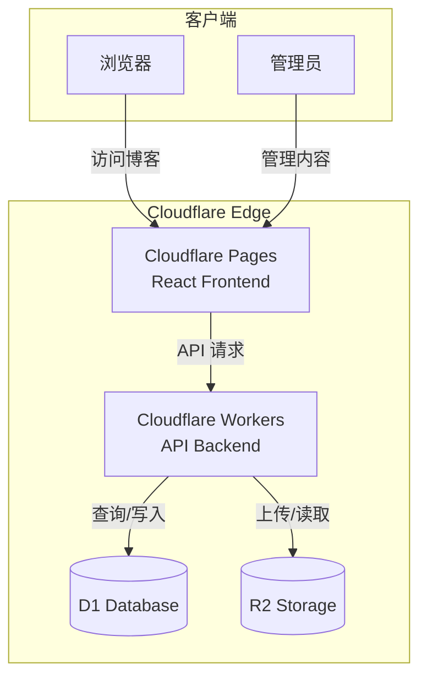
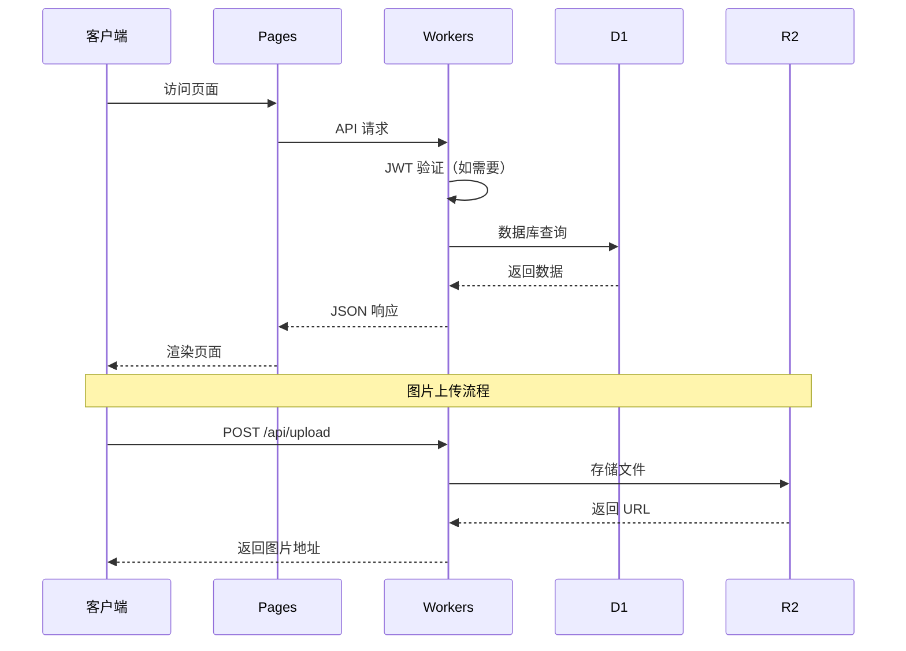
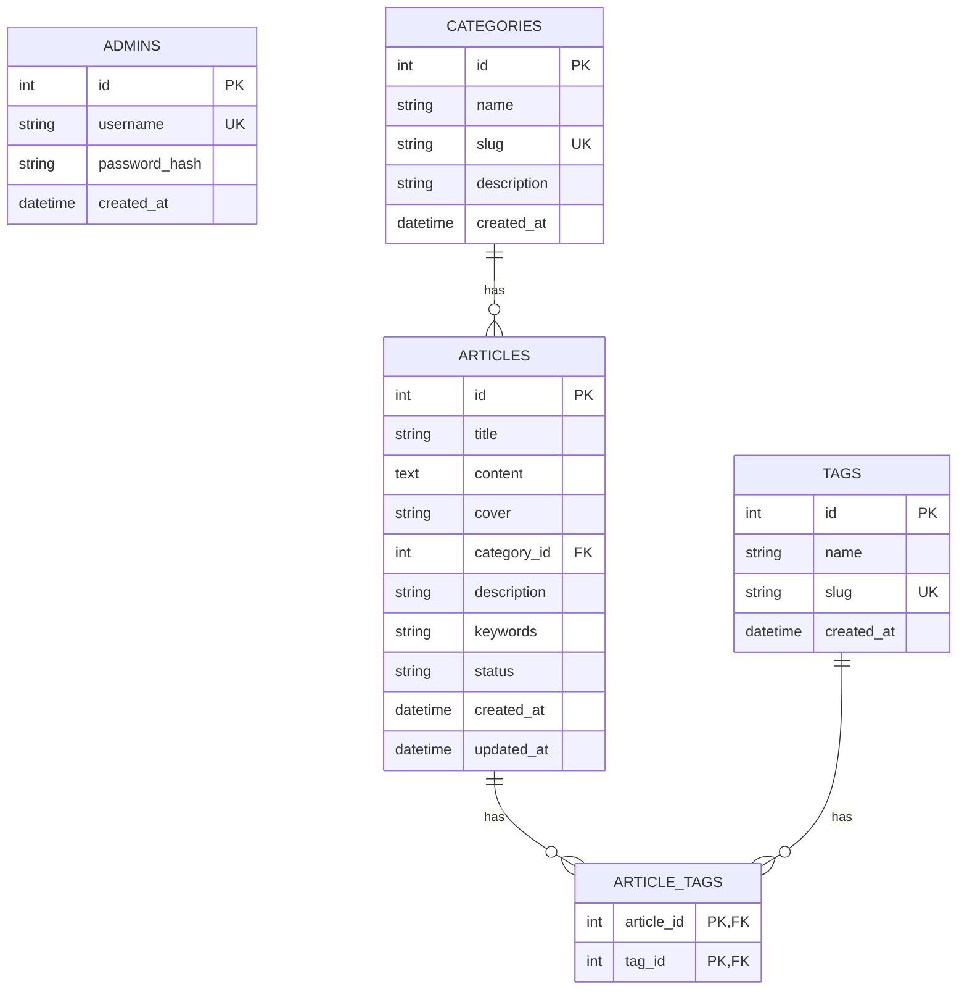

# 设计文档

## 概述

本设计文档描述了 Cloudflare 全栈博客系统的技术架构和实现方案。系统采用完全 Serverless 架构，利用 Cloudflare 生态系统构建高性能、低成本的博客平台。

### 技术栈

- **前端**: React 18 + Vite + React Router v6 + Ant Design
- **后端**: Cloudflare Workers (TypeScript)
- **数据库**: Cloudflare D1 (SQLite)
- **存储**: Cloudflare R2
- **认证**: JWT (jose 库)

### 项目结构

```
/
├── frontend/                 # React 前端项目
│   ├── src/
│   │   ├── components/      # 可复用组件
│   │   ├── pages/           # 页面组件
│   │   ├── api/             # API 封装
│   │   ├── hooks/           # 自定义 Hooks
│   │   ├── utils/           # 工具函数
│   │   └── App.tsx          # 应用入口
│   ├── package.json
│   └── vite.config.ts
├── backend/                  # Workers 后端项目
│   ├── src/
│   │   ├── handlers/        # 路由处理器
│   │   ├── middleware/      # 中间件
│   │   ├── models/          # 数据模型
│   │   ├── utils/           # 工具函数
│   │   └── index.ts         # 入口文件
│   ├── schema.sql           # 数据库 Schema
│   ├── wrangler.toml        # Cloudflare 配置
│   └── package.json
└── README.md
```

## 架构

### 系统架构图



### 请求流程



## 组件和接口

### 后端组件

#### 1. 路由处理器 (Handlers)

```typescript
// handlers/auth.ts - 认证处理器
interface LoginRequest {
  username: string;
  password: string;
}

interface LoginResponse {
  token: string;
  expiresAt: number;
}

// handlers/articles.ts - 文章处理器
interface ArticleListParams {
  page?: number;
  pageSize?: number;
  categoryId?: number;
  tagId?: number;
  status?: 'draft' | 'published';
}

interface ArticleListResponse {
  data: Article[];
  total: number;
  page: number;
  pageSize: number;
}

// handlers/upload.ts - 上传处理器
interface UploadResponse {
  url: string;
  filename: string;
}
```

#### 2. 中间件 (Middleware)

```typescript
// middleware/auth.ts - JWT 认证中间件
interface JWTPayload {
  sub: string;      // 用户 ID
  username: string;
  iat: number;      // 签发时间
  exp: number;      // 过期时间
}

// middleware/cors.ts - CORS 中间件
interface CORSConfig {
  allowOrigins: string[];
  allowMethods: string[];
  allowHeaders: string[];
}
```

#### 3. API 响应格式

```typescript
// 统一响应格式
interface ApiResponse<T> {
  success: boolean;
  data?: T;
  error?: {
    code: string;
    message: string;
  };
}
```

### 前端组件

#### 1. 页面组件

```typescript
// pages/Home.tsx - 首页
interface HomePageProps {
  // 无需 props，从 API 获取数据
}

// pages/Article.tsx - 文章详情页
interface ArticlePageProps {
  // 从路由参数获取 articleId
}

// pages/Admin/ArticleEditor.tsx - 文章编辑器
interface ArticleEditorProps {
  articleId?: number;  // 编辑时传入
  onSave: (article: ArticleFormData) => Promise<void>;
}
```

#### 2. API 封装

```typescript
// api/client.ts - API 客户端
interface ApiClient {
  get<T>(url: string, params?: object): Promise<T>;
  post<T>(url: string, data?: object): Promise<T>;
  put<T>(url: string, data?: object): Promise<T>;
  delete<T>(url: string): Promise<T>;
}

// api/articles.ts - 文章 API
interface ArticlesApi {
  getList(params: ArticleListParams): Promise<ArticleListResponse>;
  getById(id: number): Promise<Article>;
  create(data: ArticleFormData): Promise<Article>;
  update(id: number, data: ArticleFormData): Promise<Article>;
  delete(id: number): Promise<void>;
}
```

### API 端点设计

| 方法 | 路径 | 描述 | 认证 |
|------|------|------|------|
| POST | /api/login | 管理员登录 | 否 |
| GET | /api/articles | 获取文章列表 | 否 |
| GET | /api/article/:id | 获取文章详情 | 否 |
| GET | /api/categories | 获取分类列表 | 否 |
| GET | /api/tags | 获取标签列表 | 否 |
| POST | /api/admin/article | 创建文章 | 是 |
| PUT | /api/admin/article/:id | 更新文章 | 是 |
| DELETE | /api/admin/article/:id | 删除文章 | 是 |
| POST | /api/admin/category | 创建分类 | 是 |
| PUT | /api/admin/category/:id | 更新分类 | 是 |
| DELETE | /api/admin/category/:id | 删除分类 | 是 |
| POST | /api/admin/tag | 创建标签 | 是 |
| DELETE | /api/admin/tag/:id | 删除标签 | 是 |
| POST | /api/upload | 上传图片 | 是 |

## 数据模型

### 数据库 Schema

```sql
-- 管理员表
CREATE TABLE admins (
  id INTEGER PRIMARY KEY AUTOINCREMENT,
  username TEXT NOT NULL UNIQUE,
  password_hash TEXT NOT NULL,
  created_at DATETIME DEFAULT CURRENT_TIMESTAMP
);

-- 分类表
CREATE TABLE categories (
  id INTEGER PRIMARY KEY AUTOINCREMENT,
  name TEXT NOT NULL,
  slug TEXT NOT NULL UNIQUE,
  description TEXT,
  created_at DATETIME DEFAULT CURRENT_TIMESTAMP
);

-- 标签表
CREATE TABLE tags (
  id INTEGER PRIMARY KEY AUTOINCREMENT,
  name TEXT NOT NULL,
  slug TEXT NOT NULL UNIQUE,
  created_at DATETIME DEFAULT CURRENT_TIMESTAMP
);

-- 文章表
CREATE TABLE articles (
  id INTEGER PRIMARY KEY AUTOINCREMENT,
  title TEXT NOT NULL,
  content TEXT NOT NULL,
  cover TEXT,
  category_id INTEGER,
  description TEXT,
  keywords TEXT,
  status TEXT DEFAULT 'draft' CHECK(status IN ('draft', 'published')),
  created_at DATETIME DEFAULT CURRENT_TIMESTAMP,
  updated_at DATETIME DEFAULT CURRENT_TIMESTAMP,
  FOREIGN KEY (category_id) REFERENCES categories(id)
);

-- 文章标签关联表
CREATE TABLE article_tags (
  article_id INTEGER NOT NULL,
  tag_id INTEGER NOT NULL,
  PRIMARY KEY (article_id, tag_id),
  FOREIGN KEY (article_id) REFERENCES articles(id) ON DELETE CASCADE,
  FOREIGN KEY (tag_id) REFERENCES tags(id) ON DELETE CASCADE
);

-- 索引
CREATE INDEX idx_articles_status ON articles(status);
CREATE INDEX idx_articles_category ON articles(category_id);
CREATE INDEX idx_articles_created ON articles(created_at DESC);
```

### TypeScript 类型定义

```typescript
// models/types.ts

interface Admin {
  id: number;
  username: string;
  password_hash: string;
  created_at: string;
}

interface Category {
  id: number;
  name: string;
  slug: string;
  description?: string;
  created_at: string;
}

interface Tag {
  id: number;
  name: string;
  slug: string;
  created_at: string;
}

interface Article {
  id: number;
  title: string;
  content: string;
  cover?: string;
  category_id?: number;
  description?: string;
  keywords?: string;
  status: 'draft' | 'published';
  created_at: string;
  updated_at: string;
  // 关联数据
  category?: Category;
  tags?: Tag[];
}

interface ArticleFormData {
  title: string;
  content: string;
  cover?: string;
  category_id?: number;
  description?: string;
  keywords?: string;
  status: 'draft' | 'published';
  tag_ids?: number[];
}
```

### 实体关系图




## 正确性属性

*正确性属性是一种应该在系统所有有效执行中保持为真的特征或行为——本质上是关于系统应该做什么的形式化陈述。属性作为人类可读规范和机器可验证正确性保证之间的桥梁。*

### 属性 1：JWT 令牌往返一致性

*对于任何*有效的管理员凭据，登录后获取的 JWT 令牌应该能够被正确解码，且包含正确的用户信息和有效期（24小时）。

**验证: 需求 1.1, 1.5**

### 属性 2：无效凭据拒绝

*对于任何*无效的用户名或密码组合，登录请求应该返回 401 状态码。

**验证: 需求 1.2**

### 属性 3：JWT 认证中间件正确性

*对于任何*受保护的 API 端点，携带有效 JWT 的请求应该被允许，携带无效或过期 JWT 的请求应该返回 401。

**验证: 需求 1.3, 1.4**

### 属性 4：文章数据持久化往返

*对于任何*有效的文章数据，创建文章后通过 ID 查询应该返回相同的数据（标题、内容、状态等字段一致）。

**验证: 需求 2.2, 2.5**

### 属性 5：文章删除完整性

*对于任何*已存在的文章，删除操作后通过 ID 查询应该返回 404 或空结果。

**验证: 需求 2.4**

### 属性 6：文章状态约束

*对于任何*文章，其状态字段只能是 'draft' 或 'published' 两个值之一。

**验证: 需求 2.6**

### 属性 7：图片文件类型验证

*对于任何*非图片格式的文件上传请求，系统应该返回 400 错误。

**验证: 需求 3.3**

### 属性 8：文件名唯一性

*对于任意*两次独立的文件上传，生成的文件名应该不同。

**验证: 需求 3.5**

### 属性 9：分类数据持久化往返

*对于任何*有效的分类数据，创建后通过 ID 查询应该返回相同的数据。

**验证: 需求 4.1, 4.5**

### 属性 10：分类更新一致性

*对于任何*分类更新操作，更新后查询应该返回新的值而非旧值。

**验证: 需求 4.2**

### 属性 11：分类删除保护

*对于任何*有关联文章的分类，删除操作应该失败并返回错误。

**验证: 需求 4.3, 4.4**

### 属性 12：标签数据持久化往返

*对于任何*有效的标签数据，创建后通过 ID 查询应该返回相同的数据。

**验证: 需求 5.1, 5.4**

### 属性 13：文章标签关联完整性

*对于任何*文章添加标签操作，添加后查询文章应该包含该标签。

**验证: 需求 5.2, 5.5**

### 属性 14：标签级联删除

*对于任何*标签删除操作，相关的 article_tags 关联记录也应该被删除。

**验证: 需求 5.3**

### 属性 15：公开 API 文章状态过滤

*对于任何*公开文章列表 API 请求，返回的文章状态应该全部为 'published'，不应包含草稿文章。

**验证: 需求 6.1, 6.5**

### 属性 16：分页响应格式正确性

*对于任何*分页请求，响应应该包含 data 数组、total 总数、page 当前页、pageSize 每页数量，且 data 长度不超过 pageSize。

**验证: 需求 6.3, 6.4**

### 属性 17：Markdown 渲染有效性

*对于任何*有效的 Markdown 文本，渲染后应该产生有效的 HTML 字符串。

**验证: 需求 7.2**

### 属性 18：不存在文章返回 404

*对于任何*不存在的文章 ID 或未发布文章的公开请求，API 应该返回 404 状态码。

**验证: 需求 7.4**

### 属性 19：分类筛选正确性

*对于任何*按分类筛选的请求，返回的所有文章的 category_id 应该等于请求的分类 ID。

**验证: 需求 8.1**

### 属性 20：标签筛选正确性

*对于任何*按标签筛选的请求，返回的所有文章应该包含请求的标签。

**验证: 需求 8.2**

### 属性 21：SEO Meta 标签完整性

*对于任何*文章详情页，渲染的 HTML 应该包含 title、description、keywords 的 meta 标签。

**验证: 需求 9.1**

### 属性 22：Open Graph 标签完整性

*对于任何*文章详情页，渲染的 HTML 应该包含 og:title、og:description、og:image 标签。

**验证: 需求 9.4**

### 属性 23：API 成功响应格式一致性

*对于任何*成功的 API 请求，响应应该符合 `{ success: true, data: ... }` 格式。

**验证: 需求 11.4**

### 属性 24：API 错误响应格式一致性

*对于任何*失败的 API 请求，响应应该符合 `{ success: false, error: { code, message } }` 格式。

**验证: 需求 11.5**

## 错误处理

### 后端错误处理策略

```typescript
// 错误类型定义
enum ErrorCode {
  UNAUTHORIZED = 'UNAUTHORIZED',
  FORBIDDEN = 'FORBIDDEN',
  NOT_FOUND = 'NOT_FOUND',
  BAD_REQUEST = 'BAD_REQUEST',
  VALIDATION_ERROR = 'VALIDATION_ERROR',
  INTERNAL_ERROR = 'INTERNAL_ERROR',
  CONFLICT = 'CONFLICT',
}

// 错误响应格式
interface ErrorResponse {
  success: false;
  error: {
    code: ErrorCode;
    message: string;
    details?: Record<string, string>;
  };
}
```

### 错误场景处理

| 场景 | 错误码 | HTTP 状态 | 处理方式 |
|------|--------|-----------|----------|
| 登录凭据无效 | UNAUTHORIZED | 401 | 返回通用错误信息，不泄露具体原因 |
| JWT 无效/过期 | UNAUTHORIZED | 401 | 要求重新登录 |
| 资源不存在 | NOT_FOUND | 404 | 返回资源类型和 ID |
| 请求参数无效 | VALIDATION_ERROR | 400 | 返回具体字段错误 |
| 文件类型不支持 | BAD_REQUEST | 400 | 返回支持的文件类型列表 |
| 文件过大 | BAD_REQUEST | 400 | 返回大小限制 |
| 分类有关联文章 | CONFLICT | 409 | 返回关联文章数量 |
| 数据库错误 | INTERNAL_ERROR | 500 | 记录日志，返回通用错误 |

### 前端错误处理

```typescript
// API 错误拦截器
const handleApiError = (error: ApiError) => {
  switch (error.code) {
    case 'UNAUTHORIZED':
      // 清除 token，跳转登录页
      localStorage.removeItem('token');
      navigate('/login');
      break;
    case 'NOT_FOUND':
      // 显示 404 页面
      navigate('/404');
      break;
    case 'VALIDATION_ERROR':
      // 显示表单错误
      showFormErrors(error.details);
      break;
    default:
      // 显示通用错误提示
      message.error(error.message);
  }
};
```

## 测试策略

### 测试类型

1. **单元测试**: 测试独立函数和组件
2. **属性测试**: 验证系统的通用属性
3. **集成测试**: 测试 API 端点和数据库交互

### 测试框架

- **后端**: Vitest + miniflare (Cloudflare Workers 测试环境)
- **前端**: Vitest + React Testing Library
- **属性测试**: fast-check

### 属性测试配置

```typescript
// 每个属性测试至少运行 100 次迭代
import fc from 'fast-check';

// 示例：文章数据持久化往返测试
// Feature: cloudflare-blog-system, Property 4: 文章数据持久化往返
test('文章创建后应能正确查询', async () => {
  await fc.assert(
    fc.asyncProperty(
      fc.record({
        title: fc.string({ minLength: 1, maxLength: 200 }),
        content: fc.string({ minLength: 1 }),
        status: fc.constantFrom('draft', 'published'),
      }),
      async (articleData) => {
        const created = await createArticle(articleData);
        const fetched = await getArticle(created.id);
        return (
          fetched.title === articleData.title &&
          fetched.content === articleData.content &&
          fetched.status === articleData.status
        );
      }
    ),
    { numRuns: 100 }
  );
});
```

### 测试覆盖要求

| 模块 | 单元测试 | 属性测试 | 集成测试 |
|------|----------|----------|----------|
| JWT 认证 | ✓ | ✓ | ✓ |
| 文章 CRUD | ✓ | ✓ | ✓ |
| 分类管理 | ✓ | ✓ | ✓ |
| 标签管理 | ✓ | ✓ | ✓ |
| 文件上传 | ✓ | ✓ | - |
| 分页查询 | ✓ | ✓ | ✓ |
| Markdown 渲染 | ✓ | ✓ | - |
| SEO 标签 | ✓ | ✓ | - |

### 单元测试与属性测试的互补性

- **单元测试**: 验证具体示例、边界条件、错误场景
- **属性测试**: 验证所有输入的通用属性，通过随机化发现边界情况
- 两者结合提供全面的测试覆盖
